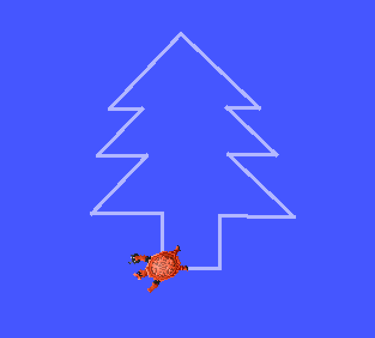
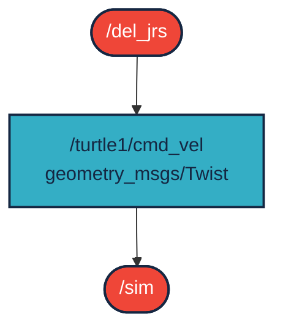

# `del_jrs` package
ROS 2 Humble python turlesim package that draws a pine tree.  [](https://docs.ros.org/en/humble/)
## Packages and build

It is assumed that the workspace is `~/ros2_ws/`.

### Clone the packages
``` r
cd ~/ros2_ws/src
```
``` r
git clone https://github.com/DeliLaszlo/del_jrs
```

### Build ROS 2 packages
``` r
cd ~/ros2_ws
```
``` r
colcon build --packages-select del_jrs --symlink-install
```

<details>
<summary> Don't forget to source before ROS commands.</summary>

``` bash
source ~/ros2_ws/install/setup.bash
```
</details>

``` r
ros2 launch del_jrs del_jrs.launch.py
```


## Graph

The `/del_jrs` node publishes a `/turtle1/cmd_vel` topic (type: `geometry_msgs/Twist`) and ths simulator node (`/sim`) subscribes to the command topic.



``` r 
ros2 topic type /turtle1/cmd_vel

geometry_msgs/msg/Twist
```
